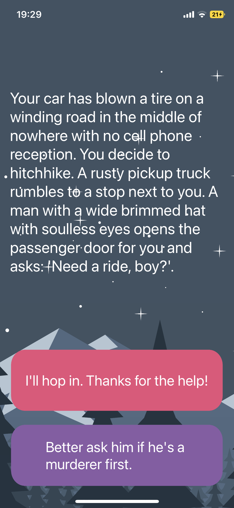

#  Destini

## Portrait

## Our Goal

The goal of this challenge is to get you comfortable with implementing the MVC design pattern and thinking about the state of your app. In addition, you will be reviewing the concept of Swift Structures and using it to separate the Model from the Controller. 

## What you will create

In this app, you will be creating a “choose your own adventure” game similar to the App Store hit “Life Line” app. The app will tell a story depending on what the user chooses and can be fleshed out and modified to provide an engaging story-telling experience

## COPYRIGHT
MIT License

Copyright (c) [2021] [Stewart James Clay]

Permission is hereby granted, free of charge, to any person obtaining a copy
of this software and associated documentation files (the "Software"), to deal
in the Software without restriction, including without limitation the rights
to use, copy, modify, merge, publish, distribute, sublicense, and/or sell
copies of the Software, and to permit persons to whom the Software is
furnished to do so, subject to the following conditions:

The above copyright notice and this permission notice shall be included in all
copies or substantial portions of the Software.

THE SOFTWARE IS PROVIDED "AS IS", WITHOUT WARRANTY OF ANY KIND, EXPRESS OR
IMPLIED, INCLUDING BUT NOT LIMITED TO THE WARRANTIES OF MERCHANTABILITY,
FITNESS FOR A PARTICULAR PURPOSE AND NONINFRINGEMENT. IN NO EVENT SHALL THE
AUTHORS OR COPYRIGHT HOLDERS BE LIABLE FOR ANY CLAIM, DAMAGES OR OTHER
LIABILITY, WHETHER IN AN ACTION OF CONTRACT, TORT OR OTHERWISE, ARISING FROM,
OUT OF OR IN CONNECTION WITH THE SOFTWARE OR THE USE OR OTHER DEALINGS IN THE
SOFTWARE.
